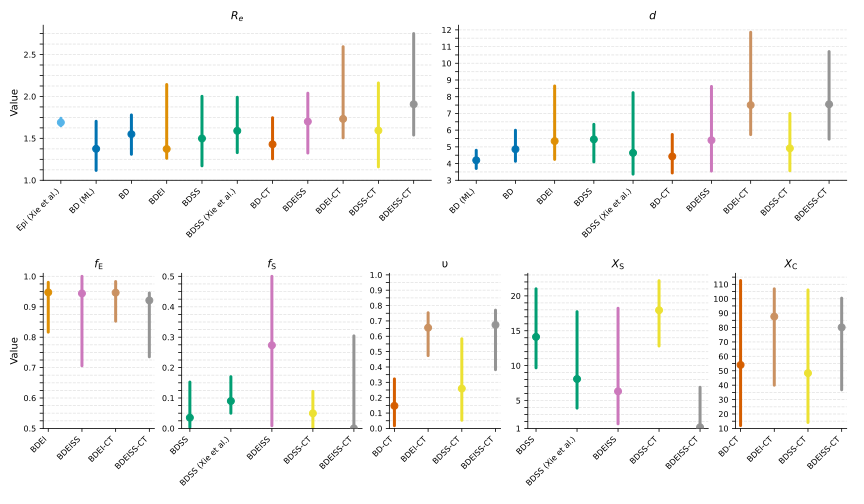

The folder contains the data, scripts and analysis results for the wave 3 of SARS-CoV-2 epidemic in Hong Kong:

1. [wave3.days.nwk](wave3.days.nwk) is the transmission tree from [Xie _et al._ 2024](https://doi.org/10.1093/molbev/msae232), 
   resolved with contact-tracing data and rescaled to days;
2. [main.py](main.py) is the script that can be used to run the epidemiological parameter inference on this tree with the BD(EI)(SS)(-CT) models;
3. [wave3.days.estimates.csv](wave3.days.estimates.csv) contains the estimates of the epidemiological parameters inferred with `main.py` on the tree `wave3.days.nwk` with the BD(EI)(SS)(-CT) models;
4. [wave3.days.estimates.log_ss](wave3.days.estimates.log_ss) list the models and summary statistics, for which the statistics calculated on the `wave3.days.nwk` are more than 5 standard deviations away from the statistics calculated on training data for the corresponding BD(EI)(SS)(-CT) model, inferred with `main.py`;
5. [plot_covid.py](plot_covid.py) is the script that can be used to plot the parameters stored in `wave3.days.estimates.csv`.
6. [Fig_covid.svg](Fig_covid.svg) is the figure generated by `plot_covid.py` with the estimates of the epidemiological parameters inferred with `main.py` on the tree `wave3.days.nwk` with the BD(EI)(SS)(-CT) models:

